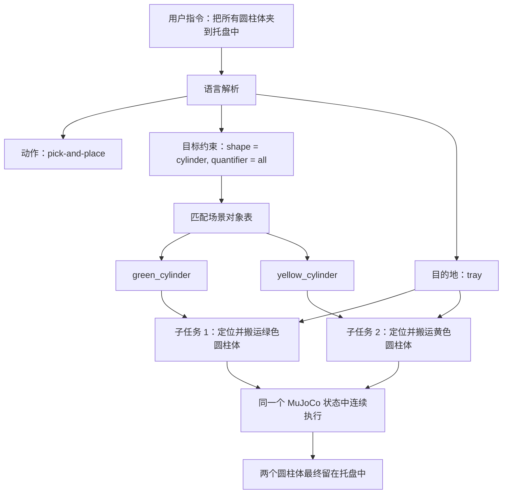

# 从多物体场景开始：让机械臂按一句话连续整理桌面

上一篇里，我把重点放在了“机械臂如何通过深度相机和视觉模型找到一个目标，并把它抓起来”。那时桌面上主要是一个明确目标：红色方块。

这一步很重要，因为它证明了闭环是成立的：机械臂不需要我提前告诉它坐标，而是可以先拍照、识别、反投影到三维，再用 RRT-Connect 规划路径，最后在 MuJoCo 里完成一次带接触和摩擦的抓取。

但这还不是一个真正有用的桌面操作系统。

真实桌面远比单个目标复杂。它可能有不同类别、不同材质、不同姿态的物体，也可能有遮挡、重叠、反光和无关干扰。真实世界的全部复杂性不可能被完整复刻，所以这里先用不同颜色、不同形状、不同位置的方块和圆柱体，构造一个可控但更接近实际问题的桌面场景。用户也不会总是说“抓这个红色方块”，而是会说更接近任务的话：

**把蓝色方块放到托盘中。**

或者更进一步：

**把所有圆柱体夹到托盘中。**

所以最近这一步，我把项目从“单物体抓取”推进到了“多物体场景中的语言指令操作”。

图：夹爪根部 D435i 看到的多物体桌面场景。桌面上同时存在不同颜色的方块和圆柱体，右侧加入了托盘作为放置目标。

## 桌面上不再只有一个目标

之前的单方块抓取，目标非常明确。只要视觉模型找到了红色方块，后面的流程基本就能接上。

多物体场景不一样。

在当前模拟场景里，桌面上同时放置了红色方块、蓝色方块、紫色方块、绿色圆柱体、黄色圆柱体。它们用来代表复杂场景中的多类目标和干扰物：形状不同、颜色不同、位置不同。系统首先要解决的不是“怎么抓”，而是“用户说的是哪一个”。

于是我把场景生成单独扩展了一层：多物体桌面场景不再是手工摆出来的临时文件，而是由场景生成代码统一生成。每个物体都有自己的形状、颜色、初始位置、尺寸、质量、摩擦参数和 free joint。这样后续验证时，视觉、深度、规划、动力学都面对同一套可复现的场景。

这一步看起来像工程整理，但它很关键。机器人项目一旦场景混乱，后面所有验证都会变得含糊：到底是在验证视觉识别，还是在验证路径规划？到底是动态物体被夹起来了，还是静态目标点被碰到了？所以我把多物体操作场景和之前的 RRT-Connect 红蓝目标球场景继续分开，避免测试污染。

## 为什么要加入托盘

只会抓起来还不够，桌面操作通常还要“放到某个地方”。

于是我在桌面旁边加入了一个托盘。托盘不是一个装饰模型，而是有碰撞几何的环境物体：它有底板，也有四周的边框。机械臂把物体放进去时，托盘会参与碰撞和接触验证。

这带来两个变化。

第一，语言指令里出现了新的目标区域。用户不再只说“左侧”“右侧”“中间”，还可以说“托盘中”。系统要把“托盘”解析成一个真实的世界坐标区域。

第二，放置动作不能再默认按桌面高度判断。物体放在托盘里时，落点高度应该基于托盘底板，而不是桌面平面。否则自动验证会出现一种很隐蔽的错误：物体其实放在托盘上，但系统仍按桌面高度判断，导致高度检查不准确。

所以这一步不仅是加了一个物体，而是让“目的地”开始成为场景的一部分。

## 从一句话里解析出任务

有了多物体和托盘，语言解析就不能只做简单关键词匹配了。

比如这句：

**把蓝色方块放到托盘中。**

系统需要解析出几件事：动作是 pick-and-place，目标颜色是蓝色，目标形状是方块，候选物体是 blue cube，目的地是 tray。

再看这句：

**把所有圆柱体夹到托盘中。**

这句话更复杂。它不是一个目标，而是一组目标。系统要识别“所有”这个量词，然后在当前场景里找到所有形状为圆柱体的候选物体：绿色圆柱体和黄色圆柱体。

也就是说，这里语言解析的输出不再只是一个 object name，而是一个任务集合：

解析结果大致可以理解为：目标集合是绿色圆柱体和黄色圆柱体，目的地是托盘，动作是夹取并放置，执行方式是依次搬运。

这一步是从“单次抓取技能”走向“任务级操作”的开始。

## 视觉模型仍然只负责找目标区域

虽然语言指令变复杂了，但我仍然保持一个边界：视觉语言模型只负责在 RGB 图上找目标区域，不直接控制机械臂。

完整链路可以概括为：语言指令先变成目标约束，D435i 从多个视角拍下 RGB 和深度图，视觉模型在图像中框出目标区域，深度信息把这个区域反投影成三维目标点，RRT-Connect 负责生成抓取和放置路径，最后 MuJoCo 用接触、摩擦和动力学验证动作是否真的成立，再通过视频交给人来做最终验收。

这里大模型负责“看图选区域”，深度相机负责“把区域变成三维位置”，路径规划负责“怎么过去”，MuJoCo 负责“这个动作在物理上是否成立”。

我不希望大模型直接输出关节角，也不希望它绕过深度相机直接猜坐标。机器人系统里，语义理解和几何控制应该分层。这样即使视觉模型偶尔不稳定，后面还有深度一致性、多视角聚类、碰撞检查和人工验收这些安全边界。

图：同一多物体场景下的深度图可视化。视觉模型给出图像区域后，深度图负责把目标区域反投影到三维空间。

## 多视角让目标定位更可靠

单视角识别在机器人任务里很容易不稳。物体可能太小，角度可能不好，阴影可能被框进去，桌面和物体边界也可能混在一起。

所以多物体操作继续沿用多视角策略：机械臂先移动到几个较高的观察位，从上方和斜上方拍摄桌面。每个视角都让视觉模型输出目标区域，再结合深度图反投影成一个三维候选点。

多个候选点不会直接平均。系统会先过滤掉高度明显不对、深度像素不足、或者落在桌面附近的结果，然后检查剩余候选是否在三维空间里一致。只有多个视角都指向同一个空间区域，才会进入后续规划。

这让视觉模型的输出从“看起来像”变成“几何上也说得通”。

## 从 pick 变成 pick-and-place

定位到目标之后，机械臂不只是抓起来，还要放到指定位置。

这时 RRT-Connect 被接入了更长的动作链：

动作链也从单纯的“靠近、夹住、抬起”，扩展成了“准备位、目标上方、抓取位、抬升、放置上方、放下、退开”。

每一段都要考虑关节限制、碰撞和奇异性。抓取阶段要让夹爪接近物体并闭合；搬运阶段要保持夹爪闭合，把物体带到托盘上方；放置阶段要下降到合适高度，打开夹爪，然后退开。

这一步让我意识到，RRT-Connect 不只是上一阶段的“路径规划实验”。它已经变成了整个操作闭环里的核心运动规划能力。视觉和语言告诉系统目标是什么、在哪里；RRT-Connect 决定机械臂怎样安全地过去。

图：输入“把蓝色方块放到托盘中”后，系统通过多视角 VL 和深度定位蓝色方块，并规划 pick-and-place 动作放入托盘。

## 最关键的一步：连续搬运所有圆柱体

“把所有圆柱体夹到托盘中”比“把蓝色方块放到托盘中”难很多。

因为这不是一次动作，而是一组动作。更重要的是，它不能简单地把两个独立视频片段拼在一起。真正合理的做法是：第一个圆柱体放进托盘之后，场景状态必须保留下来；机械臂再去抓第二个圆柱体时，第一个圆柱体还应该真实地躺在托盘里。

所以我把集合任务改成了连续仿真。

系统会先解析出所有圆柱体，然后为每个圆柱体分别做视觉定位和 RRT-Connect 规划。但执行时，它们不再各自新建一个仿真。所有动作会被送进同一个 MuJoCo `MjData` 状态里依次播放。

这意味着：

也就是说，绿色圆柱体被夹起并放入托盘后，会继续留在托盘中；机械臂退开并过渡到下一段动作，再去抓黄色圆柱体；黄色圆柱体被放进托盘的另一个槽位后，最终两个圆柱体会同时留在同一个托盘里。

这才像一个真正的桌面整理任务。

图：输入“把所有圆柱体夹到托盘中”后，机械臂在同一个连续仿真状态里依次搬运绿色圆柱体和黄色圆柱体。

## 调参里暴露出的真实问题

连续仿真一跑起来，问题马上出现了。

第一个圆柱体放下后，机械臂开始第二段动作的瞬间太快，看起来像突然切换姿态。更麻烦的是，第二次放置时还可能碰到第一个已经放好的圆柱体。

这两个问题都很真实。

第一个问题来自段间过渡。之前两段动作之间只有一个较短的关节空间桥接，虽然数学上能从上一段 retreat 连接到下一段 ready，但视觉上太突然。后来我把集合任务的段间过渡时间从 1.2 秒拉长到 2.4 秒，让机械臂有一个更平滑的开夹爪过渡。

第二个问题来自托盘槽位。最开始两个圆柱体的目标槽位在托盘里横向相邻，距离太近。第二个圆柱体放下时，夹爪和物体都有机会扫到第一个。后来我把槽位改成对角线分布：第一个放在托盘左前区域，第二个放在右后区域，让两个目标位置明显拉开。

这个过程很有意思：自动脚本一开始也许能通过，但视频一看就知道“不够好”。机器人验证不能只看数值，还必须看动作是否合理。

## MCP：把机械臂能力变成可调用工具

这套能力也被封装进了 MCP 工具里。

现在外部调用方不需要知道底层 MJCF、IK、RRT-Connect、深度反投影和 MuJoCo 渲染细节。它只需要调用一个高层的语言搬运技能，输入一句“把所有圆柱体夹到托盘中”，工具内部就会完成语言解析、多视角拍照、视觉定位、深度反投影、路径规划、连续仿真和视频渲染。

这正是我希望项目走向的方向：机械臂不是一个孤立脚本，而是一个可以被大模型调用、可验证、有边界的操作系统。

## 现在完成到了哪一步

这一阶段完成后，系统已经具备了几个新的能力：

具体来说，它现在可以生成包含方块、圆柱体和不同颜色物体的多物体桌面场景；可以把托盘作为真实碰撞几何加入场景；可以解析“所有圆柱体”这样的集合目标；可以在多物体场景中通过 VL 和深度定位目标；可以规划 pick-and-place，而不只是 pick；可以在同一个 MuJoCo 状态中连续搬运多个物体；也可以通过视频做动作质量验收。

从功能上看，这已经不只是“抓一个东西”了，而是开始接近“根据一句话整理桌面”。

## 下一步：开始往 VLA 走

做到这里之后，下一步计划就比较明确了：开始往 VLA 走。

目前系统已经通过 VL 模型参与视觉分析，再结合深度相机、RRT-Connect、夹爪动力学和 MuJoCo 验证，完成了从语言指令到连续操作的闭环。接下来不只是继续增加更多固定流程，而是希望让模型在视觉、语言和动作之间承担更强的任务级决策能力。

它应该能理解：桌面上有哪些物体，哪些已经操作过，哪些还没操作，当前托盘里有什么，下一步应该先抓谁，失败后要不要重新拍照。它不一定一开始就要端到端控制关节，但它需要开始承担任务级决策。

从这个角度看，前面做的这些工作不是终点，而是在给 VLA 铺底座：场景可生成，感知可调用，动作可规划，物理可验证，结果可回看。只有这些底层能力稳定，VLA 才不会变成一个只能在文字里说得很漂亮、落到机器人上却不知道怎么闭环的模型。

从单个红色方块，到多物体桌面，再到一句话连续整理圆柱体，这一步让我更确信一件事：真正有意思的方向，是让大模型不只是“看图回答”，而是开始通过视觉、语言和动作，在一个可验证的物理世界里完成任务。
