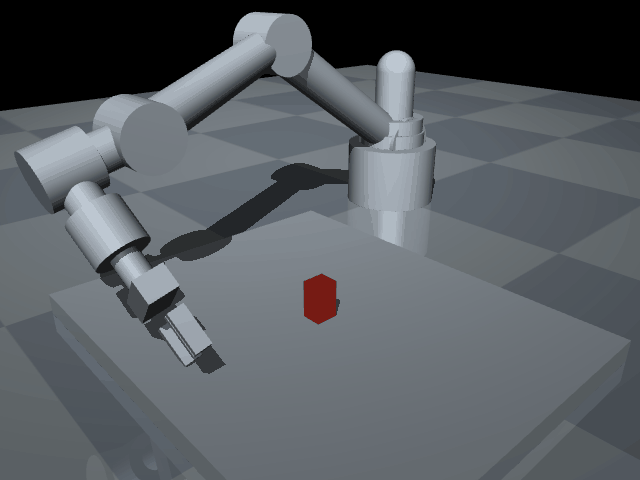
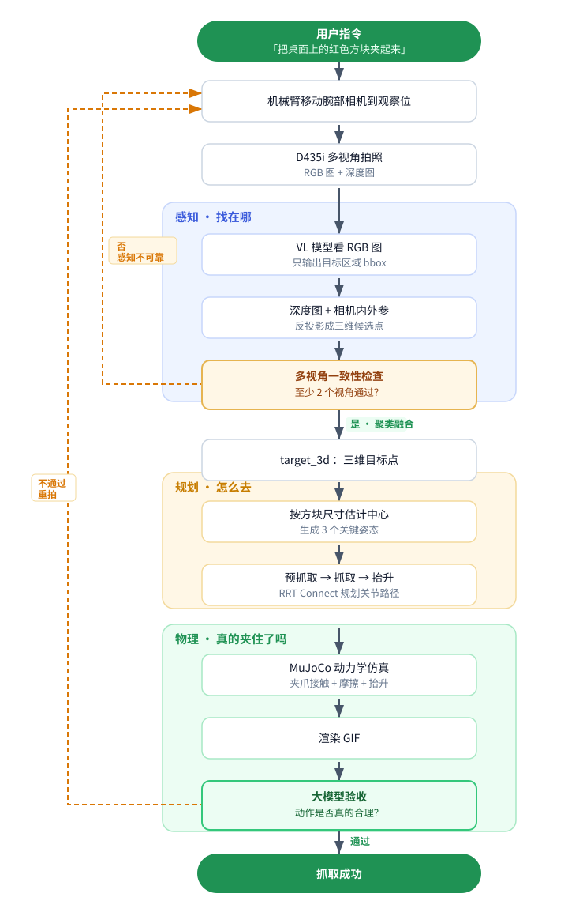
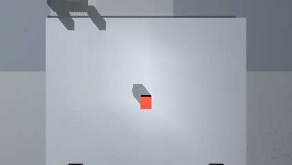
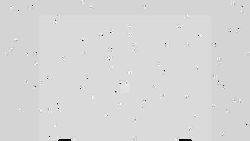
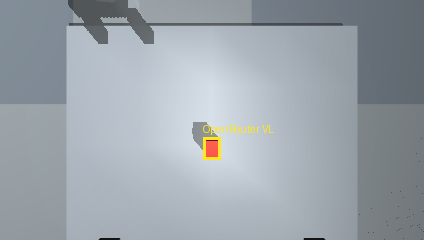
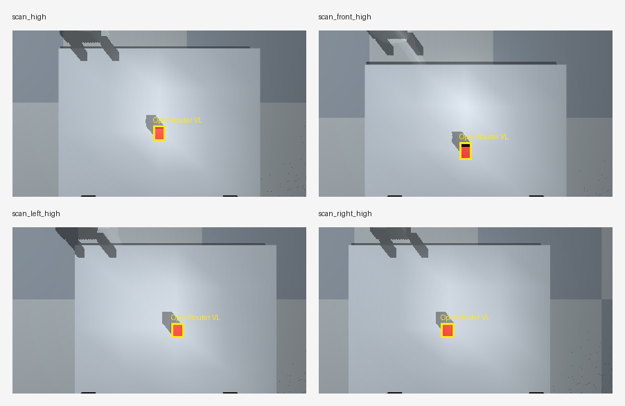

# 不给坐标，只给一句话：机械臂如何自己看见并抓起方块

我没有告诉它方块在哪。

我只说了一句：“把桌面上的红色方块夹起来。”

图：从深度相机拍照、视觉模型定位目标，到生成三维抓取点、RRT-Connect 规划路径，并在 MuJoCo 中完成夹取和抬起的闭环演示。

系统里没有任何一行代码写着方块的坐标。机械臂先把腕部的深度相机移到观察位，拍下 RGB 和深度图，让视觉语言模型在画面里找出目标，再用深度信息把这个图像区域反投影成三维空间里的一个点，最后规划路径、靠近、闭合、抬起——在 MuJoCo 的物理仿真里，方块是真的被摩擦力夹住带起来的，而不是被代码绑在了夹爪上。

这就是这一阶段我最想讲清楚的一件事：**输入从一个写死的坐标，变成了一句人话。**

## 旧范式和新范式的差别

在上一篇里，重点是 RRT-Connect 路径规划：怎么让机械臂从一个姿态运动到另一个姿态，同时避开障碍、满足关节限制、远离奇异区域。那一步解决的是“怎么过去”。

但“怎么过去”的前提，是你已经知道“去哪”。过去机械臂能动，是因为目标坐标是提前喂给它的。它并不知道桌面上有什么，也不需要知道——坐标就是答案。

这一次我想拿掉这个前提。系统拿到的不再是 `(x, y, z)`，而是一句语言指令。于是“去哪”本身变成了一个要被解决的问题，它拆成了好几层：

目标在图像里的哪里？这个图像区域对应真实三维空间里的哪个位置？机械臂该用什么执行器接触它？夹爪怎样靠近、闭合、抬起？这套动作在物理仿真里，是不是真的能把物体夹起来？

所以 RRT-Connect 之后，项目重心从“让机械臂会规划路径”，转向了“让机械臂听懂一句任务描述，并通过视觉和深度信息完成一次可验证的抓取”。

## 先看懂整条链路

在拆开每个环节之前，先把整体逻辑放在这里。这条链路最关键的特征是：**语言负责说要什么，视觉负责找在哪，几何负责算成三维，规划负责怎么去，物理负责验证真的夹住了。** 每一层只做自己该做的事，谁都不越界。

图：从语言指令到人工验收的完整闭环。感知负责找在哪、规划负责怎么去、物理负责验证真的夹住了；两条橙色虚线是系统的「不确定就退回」回路——多视角通不过、或人工验收不通过，都回到重新拍照。

接下来的每一节，其实都是在讲这张图里的某一个方框，以及它为什么必须存在。

## 末端从“一个点”变成“一只手”

RRT-Connect 阶段，机械臂末端只是一个参考点。它适合做运动学、IK 和路径规划，但它抓不了东西——一个点没有手指。

所以我先给它加了一个简化的两指平行夹爪。

我也考虑过直接上更真实的工业夹爪，比如 Robotiq 2F-85。但这个阶段我更关心先跑通闭环，而不是一上来追高保真。复杂夹爪会带来更多坐标系、碰撞几何、接触参数和装配细节，容易让问题过早发散。所以我选了一个可控的简化版：它能开合，有碰撞体，有高摩擦夹持面，能在 MuJoCo 里和方块发生真实接触。

它不是最终形态，但足够支撑下一步——真正的动力学抓取。

## 抓取不该是“剧情触发”

这里有个很容易偷懒的地方。

如果不上动力学，抓取可以写得非常省事：夹爪一到方块附近，就把方块绑到夹爪上，让它跟着走。看起来抓住了。

但那不是抓取，是动画。

我给这个项目定了一条底线：方块必须是因为接触和摩擦被夹起来的，而不是因为代码把它和夹爪绑死了。于是桌面上的小方块被设成动态物体，有质量、惯量、接触和摩擦。夹爪闭合时，两个手指通过高摩擦垫接触方块；机械臂再抬升，只有接触关系稳定，方块才会跟着上来。

这一步让项目从“轨迹动画”进入了“物理交互”——也带来了一堆很真实的麻烦：

夹爪几何。早期手指偏长、摩擦垫偏短，看起来像是结构件在顶方块，而不是橡胶垫在夹。后来我把手指缩短，让摩擦垫和手指上下平齐，把真正的高摩擦区域变成主要接触面。

下降高度。夹爪降太多，手指最低点就贴近桌面，看着像要顶穿桌子。后来我把整个抓取姿态抬高，让夹爪夹方块的上半部，而不是把夹爪中心降到方块中心附近。

速度。早期 GIF 里，机械臂从高位冲下来时有明显的“过头”。后来我按动作阶段拆速度：先快速移到方块上方，接近目标时单独放慢，夹住后再平稳抬升。同时仿真不再只按 GIF 帧率更新关节目标，而是在每个物理步重新采样连续轨迹，减少阶跃控制带来的抖动和过冲。

这些调整听起来都很小，但它们决定了抓取看起来“像不像一次真实动作”。

## 给机械臂装上第一视角

有了手，下一步是让它自己看见桌面。

我在夹爪根部加了一个简化版 D435i 深度相机。这个阶段没导入真实相机外观模型，因为重点不是长得像，而是 RGB-D 数据链路本身。相机直接挂在夹爪根部，朝向跟随夹爪姿态——机械臂手腕转到哪，相机就看到哪。这一点很关键：它不是架在桌子上空的“上帝视角”，而是和手长在一起的第一视角，所以“先看再抓”才成立。

这个相机要提供五样东西：用于 VL 判断目标区域的 RGB 图、用于把图像区域变成三维位置的深度图、用于从像素反投影的相机内参、用于把相机坐标变换到世界坐标的外参，以及让仿真更接近真实传感器的深度噪声。

前两样是直接渲染出来的：RGB 用 MuJoCo 的命名相机渲染，深度用 MuJoCo 的深度渲染输出。后两样是几何量：内参不是随手填的，而是按相机的垂直视场角（约 65°）和图像尺寸算出一组 pinhole 内参；外参输出成 OpenCV 风格的 world-to-camera 变换矩阵。有了这两个矩阵，任意一个像素加上它的深度，就能反投影回世界坐标——这正是后面“把一个框变成一个三维点”的数学基础。

最容易被忽略、但其实最重要的是第五样：深度噪声。真实的 D435i 不会给你一张干净的深度图，所以我没有让仿真作弊。深度图上会叠加三种退化：随距离增大的高斯噪声、物体边缘的 dropout、以及远距离的 dropout。默认分辨率是 848 × 480，向真实传感器看齐。让仿真带上传感器的“脏”，是为了让后面这套定位流程在真机上不至于一接触现实就崩。

这里还有一个很真实的物理约束逼着我做了设计取舍：D435i 的最小有效深度大约是 0.17 m。也就是说，当夹爪贴到方块上方准备闭合的那一刻，相机离桌面太近，反而看不清——有效深度像素会明显掉下来。所以我没有在贴近的 `grasp` 姿态拍照，而是固定用一个抬高的预抓取 / `scan` 观察位来感知：先退到方块上方一个能看全的位置拍照定位，定好三维目标之后再下去抓。在这个观察位上，有效深度像素比例稳定在 95% 左右。

还有一个小但要命的细节：D435i 的第一视角默认隐藏了 MuJoCo 的 site 调试标记。否则黄色目标点、TCP 点这些本来用来调试的标记会出现在 RGB 图里，视觉模型很可能把它们当成真实物体去框。感知链路的输入必须干净，不能混进只有开发者才看得懂的辅助标记。

图：夹爪根部 D435i 的第一视角。可以看到夹爪边缘、桌面和目标方块。

图：同一视角下的深度图可视化。深度信息负责把图像区域转换成三维位置。

这一步让机械臂从“被外部观察”变成了“自己携带第一视角感知”。后面所有视觉定位，都基于这个夹爪根部相机完成。

## 大模型只负责“看图选区域”，不碰控制

接入视觉语言模型时，我刻意划了一条边界：**大模型只在 RGB 图上找目标区域，不输出关节角，也不直接给抓取动作。**

完整分工是这样的：视觉语言模型看图、输出目标区域；深度相机提供该区域的深度；几何模块把二维区域反投影到三维世界坐标；规划模块根据三维目标生成抓取姿态和路径；MuJoCo 验证抓取过程中的接触和动力学。

这条边界很重要。大模型擅长语义理解，比如“找到桌面上的红色小方块”。但它不该绕过深度相机，也不该直接决定机械臂怎么动——动作仍然要走几何计算、碰撞检查、奇异性检查和路径规划。换句话说，大模型是感知链路里的一个环节，不是整个机器人控制系统。

图：视觉模型在 D435i RGB 图上输出目标区域。黄色框表示模型选择的小红色方块。

## 一个视角不够，所以拍很多张

单视角识别太容易出问题：目标可能很小；阴影可能被当成物体；方块侧面会让框偏大；视角太低时桌面和目标边界不清；模型有时干脆框到背景或桌面。

对聊天来说这些误差无所谓，但对抓取来说，几厘米就可能抓空、碰撞，或者夹爪压到桌面。

所以我加了多视角拍照，让相机从方块上方和几个斜上方观察同一个目标。好处有两个：不同视角能互相补充，一个看不清、另一个可能更稳；而且每个视角都能通过深度反投影得到一个三维候选点，多个候选点之间可以做空间一致性验证。

融合不是简单平均。流程会先过滤掉高度明显不对、深度像素不足、或落在桌面附近的候选，再把剩下的三维点做聚类，只有落在同一个空间簇里的结果才会被融合成最终目标。

图：四个高位视角下，视觉模型都框到了同一个红色方块。多视角结果会继续经过深度反投影和三维一致性检查。

我还加了一条保守规则：至少两个视角通过，才允许进入抓取规划。只有一个视角通过时，系统会认为感知不够可靠，宁可停下来。这是机器人系统里很重要的一点——**不确定的时候应该停，而不是假装自己知道。**

## 换个模型，结果差别巨大

视觉模型上，我先试了火山方舟 coding plan 里的 Doubao-Seed-2.0-Pro。它能接收图片，部分情况下也能识别，但在这个机器人 grounding 任务上不够稳：有时框偏大，有时框到桌面，有时不同视角选的区域不一致。

后来我通过 OpenRouter 接入 Gemini 3.5 Flash，效果明显更好。在同一组高位多视角测试里，Gemini 四个视角全部识别成功，没有一个被几何规则拒绝；它的目标框更紧，多视角反投影后的三维位置高度一致，最后成功夹起方块。

这说明模型能力差异在机器人任务里会被放大。不是所有能“看图说话”的模型都适合做机器人视觉 grounding——机器人要的是稳定、精确、可校验的目标定位。

## 三维目标点接回 RRT-Connect

有了视觉识别和深度反投影，系统能拿到一个三维目标点。但这个点还不能直接当抓取动作。

对桌面方块来说，深度相机看到的是可见表面，通常接近上表面，而不是几何中心。所以生成抓取姿态前，要按方块尺寸做一次转换，估计出方块中心。然后系统生成三个关键姿态：方块上方的预抓取姿态、夹住上半部的抓取姿态、抬升的 lift 姿态。

每一段动作都不再是简单插值，而是继续用 RRT-Connect 规划。也就是说，**RRT-Connect 从一个独立的路径规划模块，变成了抓取闭环里的核心运动规划能力。** 它没有被取代，而是被接进了更大的系统——这正是上面那张流程图里“规划”那一块的意义。

图：从视觉定位到 RRT-Connect 规划，再到 MuJoCo 动力学抓取的完整闭环演示。

## 把整套能力封装成 MCP 工具

这个阶段我还把机械臂能力封装成了 MCP 工具。这样 Codex 不只是能改代码，还能直接调用机械臂：让相机拍照、让视觉模型识别、把目标反投影到三维、规划抓取路径、执行仿真抓取、生成 GIF。它把机械臂从“一个仿真程序”变成了“一个可被大模型调用的工具系统”。

所以后续如果想让更多模型调用机械臂，我更倾向做一个本地执行器：外部模型只负责提出工具调用意图，本地执行器负责真正调用机械臂工具，并控制权限、日志、超时和验收边界。这对未来接真实机械臂尤其重要——**模型可以参与决策，但不能裸控机器人。**

## 脚本通过，不等于任务通过

机器人任务不能只看脚本输出。很多问题必须用眼睛验收：夹爪有没有穿桌面？方块是不是被真实夹住？动作有没有明显过冲？视觉模型框对目标了吗？多视角是不是真的选中了同一个物体？

所以我把验证分成两层：自动预检负责脚本、数值和文件检查；人工验收负责看每个场景对应的 GIF，确认动作是不是真的合理。这也是为什么每个关键验证案例都要生成 GIF——对机器人来说，“能跑完”只是第一步，“看起来真的对”同样重要。

## 还没解决的问题

多物体歧义还没解决。现在是单个红色方块的场景，下一步要测多个同形状、同颜色、不同位置的方块。那时不能再让视觉模型只输出一个框，而要让它输出所有候选，再由几何模块和任务逻辑来选。

bbox 不是最终答案。框选区域内部可能混着桌面、阴影、夹爪或背景。对抓取来说，mask 通常比 bbox 更可靠，后续应该支持基于 mask 的深度提取。

外部模型调用机械臂还需要工程化。Codex 现在已经能调用 MCP，但其他模型要调用机械臂，需要 MCP host 或本地 agent harness，而不只是配一个模型 API。

目前仍然是仿真抓取。虽然已经加入接触、摩擦、质量、惯量和执行器控制，但未来接真实机械臂，还需要更严格的安全边界、执行确认、急停逻辑和传感器标定。

## 下一步：从单物体抓取走向场景级操作

RRT-Connect 之后，这个项目完成了一次关键转变：机械臂不再只是“规划一条路”，而是开始具备“看见目标、理解指令、生成抓取、执行验证”的闭环能力。

下一步我更关注多物体场景。比如桌面上有多个同形状、同颜色的方块，只是位置不同。用户说“抓左边那个”“抓离机械臂最近的那个”“抓上一次没抓过的那个”，系统该怎么理解？

我觉得比较稳的方向是：让视觉模型先找出所有候选物体，让深度相机把每个候选变成三维位置，用几何关系判断“左边、右边、最近、最远”，用多视角聚类检查不同视角是否指向同一个物体，再建立场景记忆、给物体分配稳定的身份。

再往后，才是真正的 VLA 方向：视觉感知、语言指令、场景记忆、动作规划、夹爪接触和任务级技能组合。

从这个角度看，RRT-Connect 是运动规划的骨架；夹爪、D435i、视觉模型、MCP 和多视角抓取，则是在这个骨架上一点点长出来的感知与操作能力。
